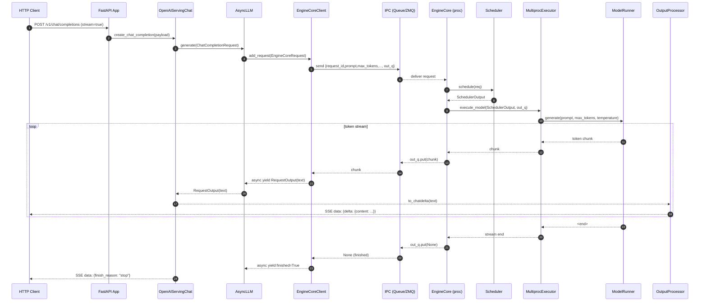

```mermaid
sequenceDiagram
    autonumber
    participant Client as HTTP Client
    participant FastAPI as FastAPI App
    participant ServingChat as OpenAIServingChat
    participant AsyncLLM as AsyncLLM
    participant CoreClient as EngineCoreClient
    participant IPC as IPC (Queue/ZMQ)
    participant Core as EngineCore (proc)
    participant Sched as Scheduler
    participant Exec as MultiprocExecutor
    participant Runner as ModelRunner
    participant OutProc as OutputProcessor

    Client->>FastAPI: POST /v1/chat/completions (stream=true)
    FastAPI->>ServingChat: create_chat_completion(payload)
    ServingChat->>AsyncLLM: generate(ChatCompletionRequest)
    AsyncLLM->>CoreClient: add_request(EngineCoreRequest)
    CoreClient->>IPC: send {request_id,prompt,max_tokens,..., out_q}
    IPC-->>Core: deliver request

    Core->>Sched: schedule(req)
    Sched-->>Core: SchedulerOutput
    Core->>Exec: execute_model(SchedulerOutput, out_q)
    Exec->>Runner: generate(prompt, max_tokens, temperature)

    loop token stream
        Runner-->>Exec: token chunk
        Exec-->>Core: chunk
        Core-->>IPC: out_q.put(chunk)
        IPC-->>CoreClient: chunk
        CoreClient-->>AsyncLLM: async yield RequestOutput(text)
        AsyncLLM-->>ServingChat: RequestOutput(text)
        ServingChat-->>OutProc: to_chatdelta(text)
        OutProc-->>Client: SSE data: {delta: {content: ...}}
    end

    Runner-->>Exec: <end>
    Exec-->>Core: stream end
    Core-->>IPC: out_q.put(None)
    IPC-->>CoreClient: None (finished)
    CoreClient-->>AsyncLLM: async yield finished=True
    ServingChat-->>Client: SSE data: {finish_reason: "stop"}

```

