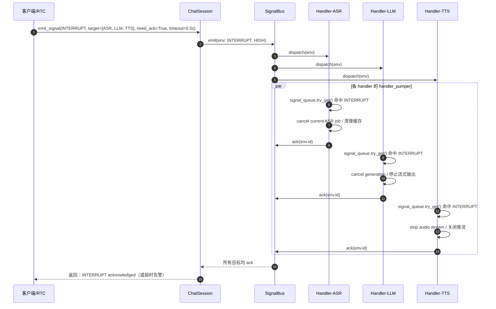
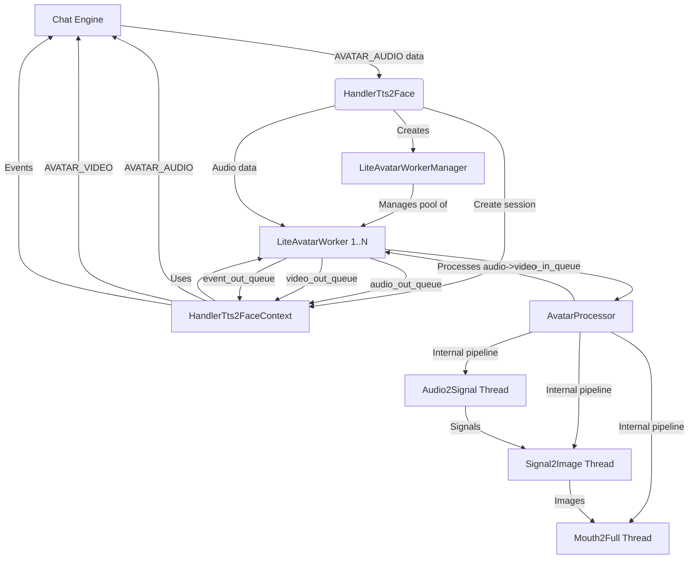
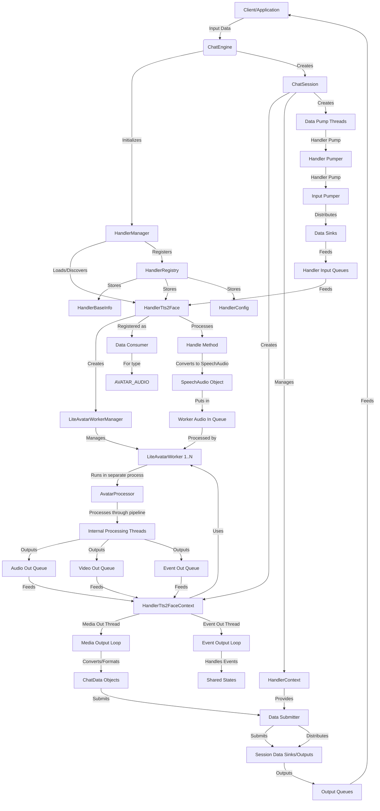

```mermaid
sequenceDiagram
  autonumber
  participant UI as 客户端/RTC
  participant CS as ChatSession
  participant SB as SignalBus
  participant H_ASR as Handler-ASR
  participant H_LLM as Handler-LLM
  participant H_TTS as Handler-TTS

  UI->>CS: emit_signal(INTERRUPT, target=[ASR, LLM, TTS], need_ack=True, timeout=0.5s)
  CS->>SB: emit(env: INTERRUPT, HIGH)
  SB->>H_ASR: dispatch(env)
  SB->>H_LLM: dispatch(env)
  SB->>H_TTS: dispatch(env)

  par 各 handler 的 handler_pumper
    H_ASR->>H_ASR: signal_queue.try_get() 命中 INTERRUPT
    H_ASR->>H_ASR: cancel current ASR job / 清理缓存
    H_ASR->>SB: ack(env.id)

    H_LLM->>H_LLM: signal_queue.try_get() 命中 INTERRUPT
    H_LLM->>H_LLM: cancel generation / 停止流式输出
    H_LLM->>SB: ack(env.id)

    H_TTS->>H_TTS: signal_queue.try_get() 命中 INTERRUPT
    H_TTS->>H_TTS: stop audio stream / 关闭推流
    H_TTS->>SB: ack(env.id)
  end

  SB-->>CS: 所有目标均 ack
  CS-->>UI: 返回：INTERRUPT acknowledged（或超时告警）
```

```mermaid
graph TD
      A[Chat Engine] -->|AVATAR_AUDIO data| B(HandlerTts2Face)
      B -->|Creates| C[LiteAvatarWorkerManager]
      C -->|Manages pool of| D[LiteAvatarWorker 1..N]

      B -->|Create session| E[HandlerTts2FaceContext]
      E -->|Uses| D

      B -->|Audio data| D
      D -->|audio_in_queue| F[AvatarProcessor]
      F -->|Processes audio->video| D
      D -->|audio_out_queue| E
      D -->|video_out_queue| E
      D -->|event_out_queue| E

      E -->|AVATAR_AUDIO| A
      E -->|AVATAR_VIDEO| A
      E -->|Events| A

      F -->|Internal pipeline| G[Audio2Signal Thread]
      F -->|Internal pipeline| H[Signal2Image Thread]
      F -->|Internal pipeline| I[Mouth2Full Thread]

      G -->|Signals| H
      H -->|Images| I
```

```mermaid
graph TD
      A[Client/Application] -->|Input Data| B(ChatEngine)
      B -->|Initializes| C[HandlerManager]
      C -->|Loads/Discovers| D[HandlerTts2Face]
      D -->|Creates| E[LiteAvatarWorkerManager]
      E -->|Manages| F[LiteAvatarWorker 1..N]

      B -->|Creates| G[ChatSession]
      G -->|Creates| H[HandlerTts2FaceContext]
      H -->|Uses| F

      C -->|Registers| I[HandlerRegistry]
      I -->|Stores| J[HandlerBaseInfo]
      I -->|Stores| D
      I -->|Stores| K[HandlerConfig]

      G -->|Manages| L[HandlerContext]
      L -->|Provides| M[Data Submitter]
      M -->|Submits| N[Session Data Sinks/Outputs]

      D -->|Registered as| O[Data Consumer]
      O -->|For type| P[AVATAR_AUDIO]

      G -->|Creates| Q[Data Pump Threads]
      Q -->|Handler Pump| R[Handler Pumper]
      R -->|Handler Pump| S[Input Pumper]

      S -->|Distributes| T[Data Sinks]
      T -->|Feeds| U[Handler Input Queues]
      U -->|Feeds| D

      D -->|Processes| V[Handle Method]
      V -->|Converts to SpeechAudio| W[SpeechAudio Object]
      W -->|Puts in| X[Worker Audio In Queue]
      X -->|Processed by| F

      F -->|Runs in separate process| Y[AvatarProcessor]
      Y -->|Processes through pipeline| Z[Internal Processing Threads]
      Z -->|Outputs| AA[Audio Out Queue]
      Z -->|Outputs| AB[Video Out Queue]
      Z -->|Outputs| AC[Event Out Queue]

      AA -->|Feeds| H
      AB -->|Feeds| H
      AC -->|Feeds| H

      H -->|Media Out Thread| AD[Media Output Loop]
      AD -->|Converts/Formats| AE[ChatData Objects]
      AE -->|Submits| M

      H -->|Event Out Thread| AF[Event Output Loop]
      AF -->|Handles Events| AG[Shared States]

      M -->|Distributes| N
      N -->|Outputs| AH[Output Queues]
      AH -->|Feeds| A
```

